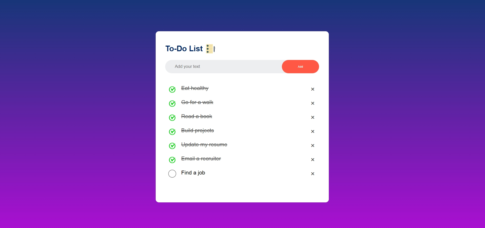
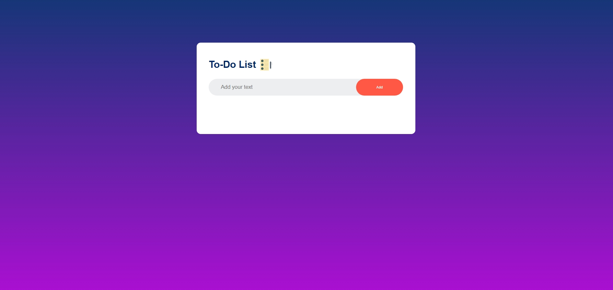
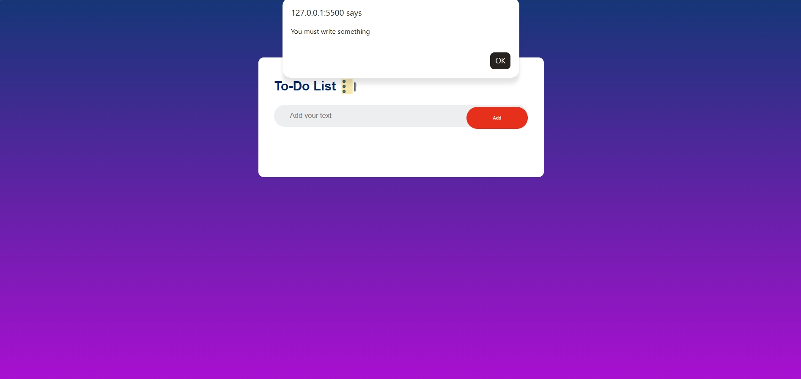
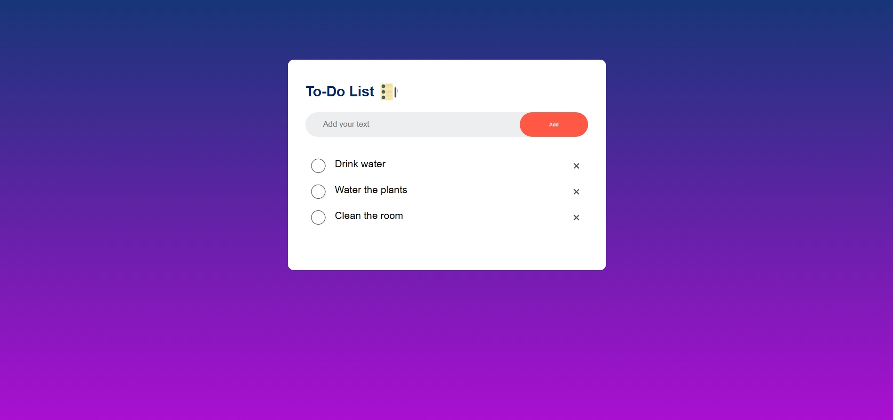
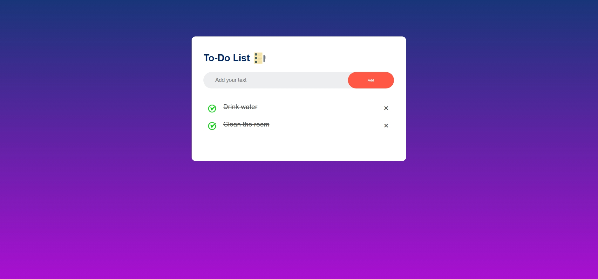

<h1 align="center"> Todo-List WebApp</h1>
A minimal To-Do List application built with HTML, CSS, and JavaScript, designed for simple and efficient task management.

<table align="center">
  <tr>
    <td></td>
  </tr>
</table>

<h2>✨ Features</h2>

<ul>
  <li>Add new tasks</li>
  <li>Mark tasks as completed</li>
  <li>Delete tasks</li>
  <li>Save tasks using Local Storage</li>
  <li>Tasks remain saved after refreshing the page</li>
  <li>Simple and responsive user interface</li>
</ul>

<h2>🛠️ Built With</h2>

<table>
  <tr>
    <td><strong>HTML5</strong></td>
    <td>Structure</td>
  </tr>
  <tr>
    <td><strong>CSS3</strong></td>
    <td>Styling and layout</td>
  </tr>
  <tr>
    <td><strong>JavaScript</strong></td>
    <td>Functionality and DOM manipulation</td>
  </tr>
  <tr>
    <td><strong>Local Storage</strong></td>
    <td>Saving tasks in the browser</td>
  </tr>
</table>

<h2> How It Works</h2>

<h3> Add a Task</h3>

  Enter a task in the input field and click the <strong>Add</strong> button.

  If the input is empty, the app will remind you:

<blockquote>
  You must write something
</blockquote>

<h3> Complete a Task</h3>

  Click on a task to mark it as completed. 
  Click it again to mark it as incomplete.

<h3> Delete a Task</h3>

  Click the <strong>×</strong> button next to a task to remove it from the list.

<h3> Save Tasks</h3>

  The app uses the browser's <strong>Local Storage</strong> to save your tasks.

  Your tasks remain saved even after refreshing the page.

## Screenshots

